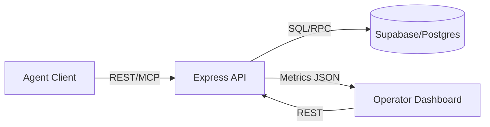

# OMEGA v0 System Architecture

## Overview

OMEGA v0 provides shared memory services for AI agents, with support for semantic retrieval,
worker role orchestration, and MCP tool compatibility. The system is composed of an API layer,
Supabase-backed storage, and an operator-facing dashboard.

## Components

- **API Service (Node.js/Express)**
  - REST endpoints for memory, worker management, and metrics.
  - MCP transport for agent tool invocation.
  - Authentication via API token headers.
- **Supabase (PostgreSQL + pgvector)**
  - `memories` table for memory data.
  - `roles`, `workers`, and `worker_role_assignments` tables for orchestration.
  - `match_memories` RPC for vector search.
- **OMEGA Dashboard (React)**
  - Displays service health, metrics, and worker role status.
  - Polls REST endpoints for live updates.

## Data Flow

## API Interfaces

- `GET /health`: Liveness signal.
- `GET /status`: System status snapshot.
- `GET /metrics`: Counts and operational metrics.
- `POST /upsert`: Store memory with embeddings.
- `POST /query`: Retrieve memories.
- `GET/POST /roles`: Manage worker roles.
- `GET/POST /workers`: Manage workers and their assignments.
- `GET /mcp/info`: MCP server metadata.
- `ALL /mcp`: MCP transport endpoint.

## Security Model

- All write endpoints require `X-BRAIN-TOKEN` or bearer token.
- CORS and host allowlists gate inbound requests.
- MCP sessions are tracked by `mcp-session-id` header.

## Deployment Notes

- Configure Supabase service role and OpenAI API keys through `.env`.
- Deploy the API and dashboard separately; configure the dashboard `VITE_API_BASE_URL`.
